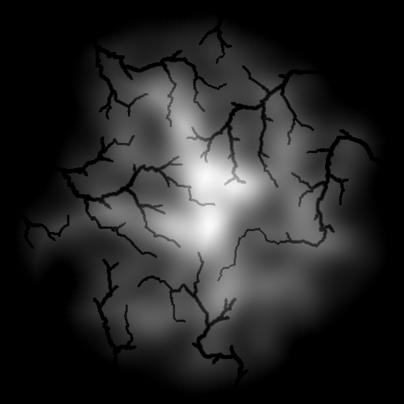

# RancHydrologyMaps

RancHydrologyMaps is a C# library for generating realistic island terrain heightmaps for games and simulations using river propagation algorithms and noise functions. This library can be used to create unique and procedurally generated maps for various applications, including game development and GIS.
Features

* Generates randomized island terrain heightmaps
* Implements river propagation algorithms for realistic river systems
* Uses noise functions for natural-looking terrain
* Optimized performance using k-d trees for efficient nearest neighbor searches
* Flexible and modular design for easy integration into existing projects

## Getting Started

## Prerequisites

    .NET Framework or .NET Core

## Installation

Clone the repository:

bash

git clone https://github.com/username/RancHydrologyMaps.git

Add the project to your solution and reference it in your game or simulation project.
Usage

Here's a basic example of how to use RancHydrologyMaps to generate a terrain heightmap:

## Using RancHydrologyMaps:

Please see HydrologyMaps/Program.cs

Contributions are welcome!

## License

RancHydrologyMaps is released under the MIT License.

## Acknowledgements

[FastNoiseLite](https://github.com/Auburn/FastNoiseLite) for noise generation
[This paper](https://hal.science/hal-01339224/document) for river graph generation

See some example heightmaps here: https://imgur.com/a/ZQvgUBc